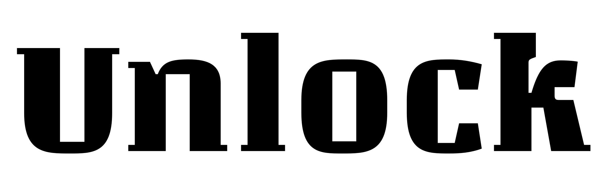
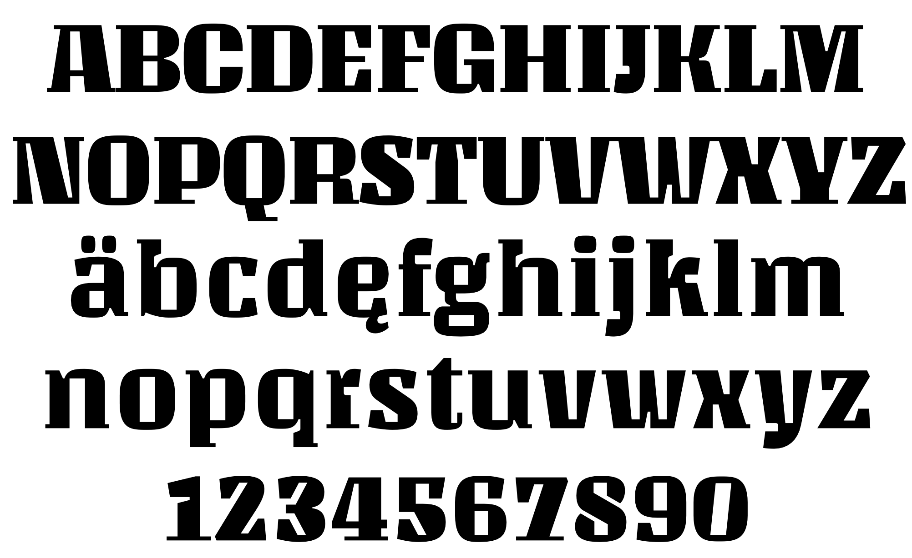

### Unlock

Unlock is a geometric typeface with vertical stress, short descenders and a significant "x" height . Basic shapes from rectangles, some with rounded corners (the only presence of curves), completely rectangular counterpounchs and innovative solutions for the joints, make Unlock has a unique style.

Their rough appearance, reminiscent of the old types of wood although the design of many of the signs we associate also a futuristic design.

Unlock is ideal for the composition of headlines and short texts but its design provides for the possibility of using it in small sizes.

### Designer

* Eduardo Rodríguez Tunni

### License

Licensed under the [*SIL Open Font License, 1.1*](https://scripts.sil.org/OFL); you may not use this file except in compliance with the License.

To contribute to the project contact Eduardo Rodríguez Tunni > edu@tipo.net.ar
